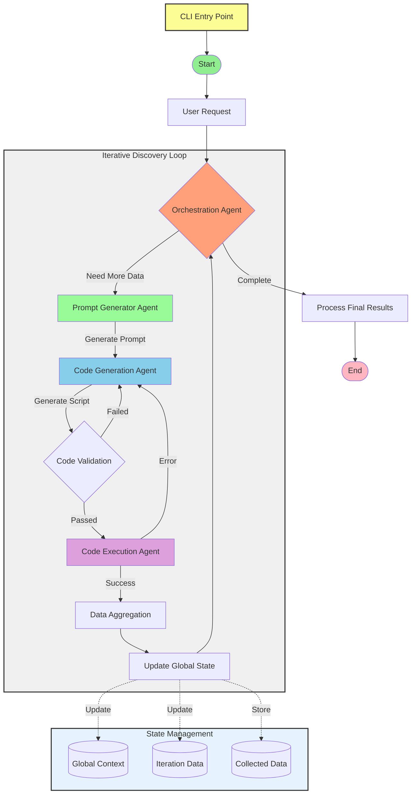

# Cloud Inspector

[](https://github.com/alexei-led/cloud-inspector/actions)
[](https://github.com/astral-sh/ruff)
[](https://codecov.io/gh/alexei-led/cloud-inspector)

A tool for generating and analyzing AWS code using various LLMs.

## Features

- Generate AWS code using different LLM models
- Structured output with multiple files:
  - `main.py` - Python script using boto3
  - `requirements.txt` - Dependencies with versions
  - `policy.json` - IAM policy with required permissions
- Automatic code analysis and validation
- Security risk detection
- AWS service and permission tracking
- LangSmith integration for tracing and monitoring

## CLI Usage

This project provides a command-line interface to trigger the workflow.

### List Models

```bash
cloud-inspector model list
```

### Execute Discovery Workflow

```bash
cloud-inspector discovery execute "<request>" --service <service_name> --thread-id <thread_id> [--cloud <provider>] [--model <model_name>]
```

Additional global options include:
  - `--log-level`: Change logging verbosity.
  - `--project`: Specify the LangSmith project for tracing.
  - `--credentials-file`: Path to the JSON/YAML file containing cloud credentials.
  - `--cloud-context`: Cloud account or project identifier.

## Workflow Architecture

Cloud Inspector uses a sophisticated multi-agent system orchestrated in an iterative workflow:



### Agents

1. **Orchestration Agent**
   - Input: User request, global state, iteration data
   - Manages the workflow state and iteration cycles
   - Tracks collected data and merges new discoveries
   - Makes decisions on:
     - Whether more data collection is needed
     - When to terminate the collection process
     - How to handle errors and retries
   - Maximum 3 iterations with up to 2 retries per iteration

2. **Prompt Generator Agent**
   - Input: Current state, user request, iteration count
   - Generates focused prompts for code generation
   - Analyzes previous discoveries to refine prompts
   - Defines required variables and success criteria
   - Ensures instructions are minimal and focused

3. **Code Generation Agent**
   - Input: CodeGenerationPrompt
   - Generates Python code for AWS SDK interactions
   - Creates complete code packages including:
     - Python scripts using boto3
     - Required dependencies with versions
     - Minimal IAM policies
   - Implements code validation and error handling
   - Uses linter to ensure code quality

4. **Code Execution Agent**
   - Input: Validated code, dependencies, IAM policy
   - Sets up isolated execution environment
   - Installs dependencies and manages AWS credentials
   - Executes code safely with timeout limits
   - Captures outputs, errors, and resource metrics
   - Handles execution errors and retries

5. **Discovery Analysis Agent**
   - Input: Execution results, current context
   - Analyzes collected data for patterns and insights
   - Identifies missing information and gaps
   - Provides recommendations for next iteration
   - Updates global context with analyzed data
   - Helps guide the orchestration process

6. **State Management**
   - Global Context: Stores collected data and iteration history
   - Iteration Data: Tracks current iteration state and outputs
   - Collected Data: Aggregates and merges new discoveries
   - LangSmith Integration: Traces execution and monitors performance

## Installation

```bash
pip install -e ".[dev]"
```

### Local Environment Setup

This project uses [direnv](https://direnv.net/) to automatically load environment variables.
Ensure you have [direnv](https://direnv.net/) installed. The provided `.envrc` file will:
  - Set up your virtual environment (using `layout python`)
  - Automatically load environment variables from a local `.env` file.

To enable, run:

```bash
direnv allow
```

## Configuration

Create a `.env` file based on `.env.example`:

```bash
cp .env.example .env
```

Required environment variables:

- `OPENAI_API_KEY` - Your OpenAI API key
- `LANGCHAIN_API_KEY` - Your LangSmith API key
- `LANGCHAIN_PROJECT` - LangSmith project name (default: "cloud-inspector")

## Contributing

1. Fork the repository
2. Create a feature branch
3. Make your changes
4. Run tests
5. Submit a pull request

## Continuous Integration & Validation

This repository uses GitHub Actions to run tests, linting, and code style checks on every push and pull request.
You can review the workflow configuration in [`.github/workflows/validate.yml`](.github/workflows/validate.yml).

To run tests and validations locally, simply execute:

```bash
pytest
```

## License

MIT License
