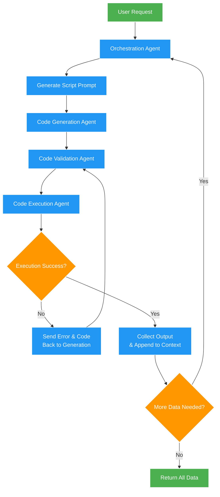

# PROJECT: Iterative, Agentic LLM-Driven Cloud Inspection and Troubleshooting System (AWS Focus Initially)

## 1. OVERVIEW AND OBJECTIVES
This project aims to create an intelligent, iterative system that leverages Language Models (LLMs) to interact with cloud services, specifically focusing on Amazon Web Services (AWS) as the initial target. The system will dynamically generate, validate, and execute Python scripts to collect data from AWS services based on user queries. The goal is to provide actionable insights and context to address user requests by methodically generating and executing small Python scripts. The system will capture, store, and track every piece of discovered data to inform subsequent steps or iterations.

- Build an end-to-end “agentic” system that uses multiple AI models to iteratively collect data from the cloud.
- Provide actionable insights and context to address user requests by methodically generating and executing small Python scripts.
- Capture, store, and track every piece of discovered data to inform subsequent steps or iterations.
- Leverage LangChain, LangGraph, and LangSmith to create a structured workflow, define model configurations, and log results.

## 2. HIGH-LEVEL WORKFLOW

The system will follow a structured, iterative process to collect data from AWS services based on user queries. The workflow is designed to be adaptive, with each step informing the next based on the data collected so far. The system will use a combination of LLMs, code generation, validation, and execution agents to interact with AWS services securely and efficiently.

1. **User Request Input**
   - The original user query is analyzed to identify missing or helpful information needed from the cloud.

2. **Orchestration Agent (Planning & Branching)**
   - Decides whether more data is needed before finalizing an answer.
   - When more data is needed, it crafts a prompt describing the next data-fetching task.

3. **Code Generation Agent**
   - Takes the prompt from the Orchestration Agent.
   - Produces a Python script, minimal dependency requirements, and an IAM policy (if needed) to safely collect the next piece of data.

4. **Code Validation Agent**
   - Checks the Python script for obvious errors using linters or an LLM prompt for syntax/security best practices.
   - Fixes trivial issues or flags them for regeneration.

5. **Code Execution Agent**
   - Attempts to run the validated script.
   - Captures response data (standard output) and any runtime errors or exceptions.

6. **Error Handling & Correction Loop**
   - If the code fails, errors (e.g., syntax, permissions) are passed back to the Code Generation Agent for iterative fixes up to a limit of attempts.

7. **Data Collection & Aggregation**
   - On success, the data is stored in a structured format, appended to previously fetched results.
   - The Orchestration Agent reviews newly collected data, the original request, and all prior context to decide if more data is required.

8. **Iteration Limits & Completion**
   - The system repeats steps 2–7 until enough relevant data is collected or a preset iteration limit is reached (e.g., 4 loops).
   - The final, aggregated data and all metadata are returned to the user and stored for future reference.

## 3. LANGGRAPH & LANGSMITH INTEGRATION

- **Define Each Agent and Model as a Node in a LangGraph:**
  - Orchestration Agent node (decision & planning).
  - Code Generation Agent node (LLM specialized in code creation, e.g., OpenAI or Anthropic).
  - Code Validation Agent node (LLM or linting pipeline).
  - Code Execution Agent node (responsible for actually running the code).
- Each node can have its own model configuration and parameters (temperature, max tokens, etc.).
- LangSmith can store each node’s outputs, logs, and metadata such as timestamps, iteration numbers, and statuses.

## 4. DETAILED GOALS

### A. Iterative Code Generation and Execution

- Use LLMs to generate Python code snippets based on prompts from the Orchestration Agent.
- Generate small, targeted Python scripts to fetch the “next valuable piece of information.”
- Limit the scope of each script to reduce complexity and facilitate easier debugging.

### B. State Management and Context Tracking

- Track the current state of the system and the data collected so far.
- Maintain partial results from each execution in a structured JSON or database format:

  ```json
  {
    "step": 2,
    "task": "Check EC2 instance states",
    "output": {...}
  }
  ```

- Use these partial results to enrich subsequent prompts and decision steps.

### C. Agent-like Debugging and Error Feedback

- Implement a feedback loop between the Code Generation and Execution Agents.
- If the script fails, automatically capture error outputs (stack traces, permission errors, API rate limits).
- Regenerate or patch code by feeding errors back to the Code Generation Agent.
- Continue attempts until success or a set limit is reached.

### D. Orchestration and Decision Logic

- Keep an overarching Orchestration Agent controlling the flow.
- This agent checks if the system has enough data to satisfy the user’s initial query or if another iteration is required.
- **Branching logic:** Depending on discovered data (e.g., an EC2 instance is “stopped”), the Orchestration Agent might pivot to collecting different or more focused information.

### E. Validation and Security

- Integrate pre-execution linting (e.g., black, flake8, Bandit) to catch syntax, formatting, or security issues.
- Generate IAM policies or minimal permission sets as JSON, ensuring scripts run without granting excessive privileges.
- Optionally use a sandbox or isolated container environment for script execution.

### F. Data Output and Storage

- Aggregate all discovered data in a final JSON or structured format for ease of consumption.
- Use LangSmith to preserve metadata (step name, date/time, status, iteration count).
- Store final run details, so each completed session becomes a record that can be reviewed and shared.

## 5. SYSTEM COMPONENTS & AGENTS

1. **Orchestration Agent**
   - “Controls the show.” Receives user requests, tracks iteration count, and merges newly fetched data into the global context.
   - Decides if more steps are needed or if the process is complete.

2. **Code Generation Agent**
   - Specialized for Python script generation, with minimal external libraries.
   - Produces:  
     - Code snippet (main.py).
     - Dependencies list (requirements.txt).
     - IAM policy as JSON (optional, if relevant to the step).

3. **Code Validation Agent**
   - Applies automatic or LLM-driven lint checks, security scanning, and minor fixes.
   - Aims to prevent easy-to-catch syntax or library import failures.

4. **Code Execution Agent**
   - Runs the given script in an isolated environment.
   - Captures console output, error logs, and exit statuses.
   - Returns execution results to the Orchestration Agent.

5. **Error Handling**
   - If any error arises, pass the entire code snippet, the original generation prompt, and error logs back to the Code Generation Agent for fixes or alternative solutions.
   - Retry up to a certain threshold (e.g., 2-3 attempts) before aborting.

6. **Data Persistence & Final Aggregation**
   - Collect outputs from each script execution.
   - Merge with previous data to form a complete picture.
   - Return aggregated results once iteration is done.

## 6. ILLUSTRATIVE WORKFLOW DIAGRAM

Below is a sample iterative loop using a flowchart notation (Mermaid or similar):



## 7. ADDITIONAL ENHANCEMENTS

- **Performance & Cost Optimization**
  - Minimize extraneous iterations by refining orchestration logic.
  - Cache partial results and reduce repeated AWS API calls.

- **LLM Model Comparison & Experimentation**
  - Plug in different models (OpenAI GPT-4, Anthropic, Amazon Bedrock) for code generation or orchestration.
  - Log success rates, error frequencies, and cost metrics.

- **Compliance & Security**
  - Incorporate best practices for AWS resource access (least privilege).
  - Validate code snippets against compliance frameworks if necessary.

- **Testing & Verification**
  - Generate mock test data (e.g., using Moto or localstack for AWS).
  - Ensure each script is verifiable before actually calling real AWS services.

- **Multi-Cloud Expansion (Future Scope)**
  - Extend approach to GCP and Azure with minimal modifications.
  - Provide platform-agnostic code generation or resource mappings.

## 8. TRACKING & LOGGING (LANGSMITH)

- For each step of the graph (Orchestration, Generation, Validation, Execution):
  - Record start/end time, status (success/fail), any generated code, and outputs.
  - Store metadata in a structured log (JSON or DB).

- **Final Run Artifact**
  - Contains aggregated data from all successful fetches plus any residual errors.
  - Includes iteration count, user request details, date/time, and final system status.

## 9. CONCLUSION

By embracing an agentic, iterative approach, this system can comprehensively address the user’s request by dynamically generating, validating, and running minimal Python scripts that each fetch the “next valuable piece of data.” Along with structured logging and an isolated execution environment, this design aims for security, granularity, and maintainability.

### Key benefits of this new plan include:

- An adaptive workflow that only gathers additional data if needed.
- Automatic error handling and code correction loops.
- Flexible design that supports multiple LLMs and easy expansion to other cloud providers.
- Rich logging and output storage to ensure reproducibility and continuous improvement.
