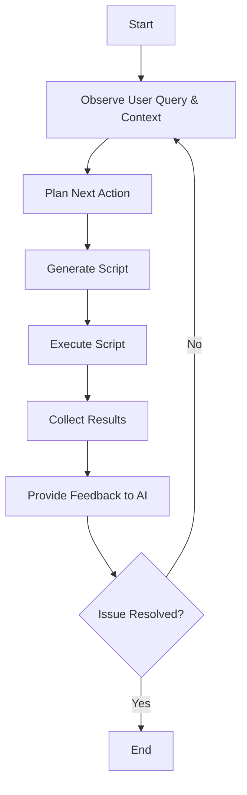
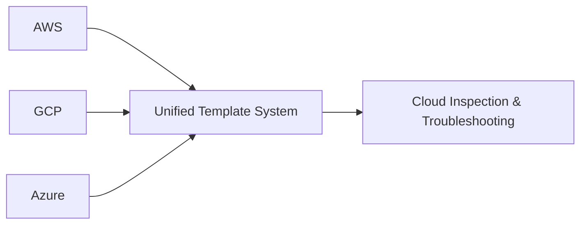

# Project: Iterative LLM-driven Cloud Inspection and Troubleshooting System (AWS Focus Initially)

## Objective

Develop a Python-based system utilizing **LangChain**, **LangGraph**, and **LangSmith** to perform iterative, multi-step cloud inspection and troubleshooting. The system aims to:

1. **Iterative Code Generation and Execution**
   - Generate small, targeted Python scripts for specific cloud resource checks.
   - Execute scripts iteratively, allowing AI decision logic to guide the next steps based on previous results.

2. **State Management and Context Tracking**
   - Maintain a structured schema for storing partial results from each execution.
   - Provide context for AI reasoning in subsequent iterations.

3. **Agent-like Debugging Process**
   - Implement a feedback loop where AI observes, plans, acts, and learns from execution outcomes.
   - Utilize AI's decision-making capabilities to handle branching and iterative refinement.

4. **Error Handling and Correction**
   - Detect runtime errors and analyze API error messages.
   - Automatically suggest and apply code modifications based on execution feedback.

5. **Performance and Cost Optimization**
   - Reduce latency and costs by balancing the granularity of iterations.
   - Implement caching and rate-limiting strategies to manage API calls efficiently.

6. **LLM Model Comparison**
   - Evaluate different LLM models (OpenAI, Anthropic, Local, Amazon Bedrock) for:
     - Code generation quality and correctness.
     - Cost efficiency and performance.
     - Problem-solving capabilities in iterative workflows.

7. **End-to-End Troubleshooting Workflow**
   - Convert user problems into initial prompts for code generation.
   - Generate and execute inspection code iteratively.
   - Collect and format data to provide context for problem resolution.

## Current Implementation Status

1. **Prompt Management:** ✅
   - YAML-based prompt system implemented.
   - Variable validation and injection.
   - Template system with model-specific adjustments.
   - Service-based organization with tagging.

2. **LLM Integration:** ✅
   - Model registry with YAML configuration.
   - Provider-specific parameter handling.
   - Capability-based model selection.
   - Structured output parsing.

3. **Code Generation and Execution:** ✅
   - Robust error handling.
   - Code formatting and validation.
   - Automatic import management.
   - Token limit handling with continuation support.

4. **Code Review and Correction:** ✅
   - Syntax validation.
   - Import statement verification.
   - Basic security checks.
   - Automatic code formatting using tools like **Black**, **autopep8**, **autoflake**.

5. **Output Management:** ✅
   - Organized output directory structure.
   - Metadata tracking.
   - **LangSmith** integration for monitoring.
   - Result filtering and statistics.

6. **AWS Focus:** ✅
   - Initial AWS prompts implemented.
   - **boto3** integration.
   - IAM policy generation.
   - Service-specific templates.

## New Enhancement Opportunities

### 1. Iterative, Agent-like Debugging Process

**Implement an Agent Loop Model:**

- Adopt an iterative process where the AI observes, plans, acts, and receives feedback.
- This enables handling of branching logic and decision-making based on real-time data.

**Workflow Steps:**

1. **Observation:** AI analyzes the user query and current context.
2. **Planning:** AI decides the next specific action (internal chain-of-thought).
3. **Action:** Generate a brief, targeted script for the specific check.
4. **Execution:** Run the script and collect the results.
5. **Feedback:** Provide execution results back to the AI.
6. **Iteration:** Repeat the loop until the issue is resolved or sufficient data is collected.

**Mermaid Diagram:**



### 2. State Management and Context Tracking

- **Structured Schema for Partial Results:**
  - Use a structured format (e.g., JSON) to store results from each execution step.
  - Example:

    ```json
    {
      "step": "Check EC2 instance state",
      "output": {
        "instanceId": "i-1234567890abcdef0",
        "state": "running"
      }
    }
    ```

- **Contextual Data Storage:**
  - Maintain a knowledge base of discovered facts to inform subsequent steps.

### 3. Enhanced Error Handling and Correction

- **Runtime Error Detection:**
  - Capture exceptions and error messages during script execution.
  - Feed error information back to the AI for analysis.

- **Automatic Correction Mechanism:**
  - AI analyzes errors and suggests code modifications.
  - Apply fixes automatically and re-execute if necessary.

### 4. Planner or Controller Integration

- **Separation of Concerns:**
  - Introduce a planner or controller to orchestrate the workflow.
  - The planner decides whether to proceed, repeat, or adjust the plan based on feedback.

- **Benefits:**
  - Enhances system robustness.
  - Allows for modularity and easier maintenance.

### 5. Decision Tree Logic within AI

- **Dynamic Reasoning:**
  - Enable the AI to reason about the next steps based on current findings.
  - Utilize chain-of-thought prompting or retrieval of relevant troubleshooting flows.

- **Example Flow:**
  - **Step 1:** Check if an S3 bucket has event notifications configured.
  - **Step 2:** Based on results, decide whether to check the SNS topic or Lambda function permissions.

### 6. Advanced Analysis and Optimization

- **Static Code Analysis:**
  - Integrate tools like **Bandit** for security checks.
  - Perform pre-execution linting to catch syntax errors.

- **Cost Estimation and Optimization:**
  - Estimate costs of AWS operations initiated by scripts.
  - Suggest optimizations to reduce operational costs.

- **Compliance Checking:**
  - Validate against AWS best practices and compliance frameworks.

### 7. Execution Environment and Security Enhancements

- **Sandbox Environment:**
  - Use Docker containers or isolated Python environments for script execution.
  - Ensure execution isolation and proper cleanup.

- **Provide Execution Environment Details to AI:**
  - Inform the AI about Python versions, **boto3** versions, and AWS permissions.
  - Prevent generation of code that cannot run in the given environment.

### 8. Testing and Verification Enhancements

- **Automated Tests:**
  - Generate test cases for each script.
  - Utilize mock data to simulate AWS responses where appropriate.

- **Code Verification:**
  - Implement pre-execution checks to ensure code quality.

### 9. Latency and Cost Management

- **Optimized API Calls:**
  - Balance the granularity of iterations to minimize latency and costs.
  - Implement caching to avoid redundant API calls.

- **Rate Limiting:**
  - Monitor API usage to prevent exceeding AWS service rate limits.

### 10. User Experience Improvements

- **Interactive Prompt Refinement:**
  - Allow users to interactively refine prompts based on AI feedback.

- **Real-time Validation Feedback:**
  - Provide immediate feedback on potential issues before executing scripts.

- **Rich Output Formats:**
  - Improve terminal output with enhanced formatting.
  - Offer a web interface for better visualization and interaction.

### 11. Model Expansion and Enhancement

- **Reasoning Model Support:**
  - Incorporate advanced AI models to improve decision-making and error analysis.

- **Code Correction Models:**
  - Utilize specialized models for code correction and optimization.

### 12. Multi-Cloud Support (Future Scope)

- **Extend to GCP and Azure:**
  - Develop templates and integration for Google Cloud Platform and Microsoft Azure.

- **Cross-Cloud Resource Mapping:**
  - Implement cloud-agnostic abstractions to support multi-cloud environments.

**Mermaid Diagram:**



### 13. LLM Comparison Framework

- **Performance Tracking:**
  - Record metrics such as code correctness, execution success rates, and error occurrences.

- **Cost Analysis:**
  - Analyze the cost efficiency of each LLM model.

- **Quality Metrics Collection:**
  - Collect data on code generation quality and problem-solving effectiveness.

- **Comparative Reporting:**
  - Generate comparative reports highlighting strengths and weaknesses of each model.

### 14. Problem-Solving Workflow Enhancement

- **Improved Problem-to-Prompt Conversion:**
  - Enhance the AI's ability to interpret user problems and generate effective prompts.

- **Context Extraction and Data Formatting:**
  - Automatically extract relevant context from results for AI consumption.

- **Solution Suggestion System:**
  - Provide AI-driven recommendations for resolving identified issues.

## Important Considerations

- **Maintain High Code Quality Standards**
  - Adhere to best practices in code style and structure.
  - Ensure readability and maintainability of generated scripts.

- **Focus on Security Best Practices**
  - Protect sensitive data and credentials.
  - Implement secure coding practices to prevent vulnerabilities.

- **Ease of Setup and Usage**
  - Provide clear documentation and installation guides.
  - Ensure the system is user-friendly for both developers and end-users.

- **Current Documentation**
  - Keep all documentation up-to-date with the latest system changes and features.

- **Sandbox Security**
  - Ensure that the execution environment is isolated and secure.
  - Prevent unauthorized access and data leakage.

- **API Credentials Handling**
  - Safely manage and store API credentials.
  - Avoid hardcoding sensitive information in code.

- **Performance Metrics Tracking**
  - Continuously monitor system performance.
  - Identify and address bottlenecks proactively.

- **Cost Management**
  - Optimize the system to reduce operational costs.
  - Measure cost per successful execution and strive for efficiency.

- **Consistent Evaluation Criteria**
  - Establish clear metrics for evaluating models and system performance.
  - Apply consistent criteria across different models and iterations.

## Conclusion

By embracing an iterative, agent-like approach, the system will enhance its cloud troubleshooting capabilities. Leveraging AI's decision-making to guide the troubleshooting process ensures more efficient and targeted inspections. The focus on small, manageable code snippets and stateful context tracking not only improves maintainability but also reduces the potential for errors.

Implementing these enhancements will:

- **Improve Flexibility and Adaptability**
  - Allow the system to handle a wider range of troubleshooting scenarios.
  - Enable dynamic decision-making based on real-time data.

- **Enhance User Experience**
  - Provide more accurate and relevant insights to users.
  - Offer interactive and user-friendly interfaces.

- **Optimize Performance and Costs**
  - Reduce unnecessary API calls and execution overhead.
  - Ensure efficient use of resources and cost-effectiveness.

By building on the current foundation and integrating these new capabilities, the project will deliver a powerful tool for cloud inspection and troubleshooting, capable of adapting to complex environments and evolving challenges.
