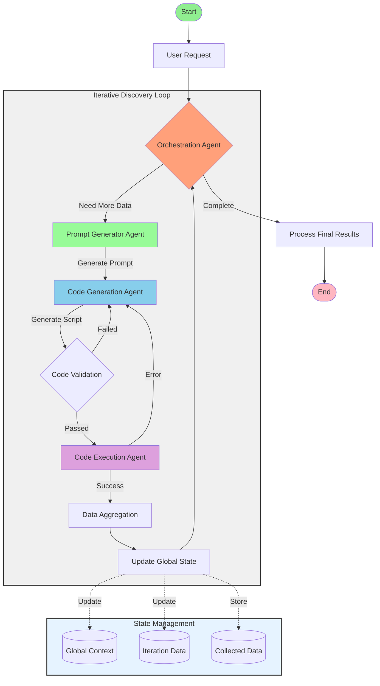

# PROJECT: Iterative, Agentic LLM-Driven Cloud Inspection and Troubleshooting System

## 1. OVERVIEW AND OBJECTIVES

This project aims to create an intelligent, iterative system that leverages Language Models (LLMs) to interact with cloud services, initially focusing on Amazon Web Services (AWS). The system will dynamically generate, validate, and execute Python scripts to collect helpful information from AWS services based on user request. The goal is to provide actionable insights and context to address user requests by methodically generating and executing small Python scripts. The system will capture, store, and track every piece of discovered data to inform subsequent steps or iterations.

- Build an end-to-end “agentic” system that uses multiple AI models to iteratively collect data from the cloud.
- Provide actionable insights and context to address user requests by methodically generating and executing small Python scripts.
- Capture, store, and track every piece of discovered data to inform subsequent steps or iterations.
- Leverage LangChain, LangGraph, and LangSmith to create a structured workflow, define model configurations, and log results.

## 2. HIGH-LEVEL WORKFLOW

The system will follow a structured, iterative process to collect data from AWS services based on user queries. The workflow is designed to be adaptive, with each step informing the next based on the data collected so far. The system will use a combination of LLMs, code generation, validation, and execution agents to interact with AWS services securely and efficiently.

1. **User Request Input**
   - The original user query is analyzed to identify missing or helpful information needed from the cloud.

2. **Orchestration Agent (Planning & Branching)**
   - Decides whether more data is needed before finalizing an answer.
   - When more data is needed, it starts the first data discovery iteration.
   - Tracks the current state of the system and the data collected so far.
   - Merges newly fetched data into the global context.
   - Reviews the current context and decides the next step:
     - If more data is needed it triggers the next iteration.
     - If enough data is collected or reaching the iteration limit, it finalizes the answer.

3. **Prompt Generator Agent**
   - The first step in each iteration loop.
   - Generates prompts for the Code Generation Agent based on the current state and the user request.
   - Provides context, previously collected data for reference, and the next piece of information to fetch.
   - Ensures instructions for script generation are focused and minimal to avoid complexity.

4. **Code Generation Agent**
   - The second step in each iteration loop.
   - Takes the prompt template and variables from the Prompt Generator Agent.
   - Generates a Python script, minimal dependency requirements, and an IAM policy (if needed) to safely collect the next piece of data.
   - Ensures the script is concise, secure, and focused on the task at hand.
   - Uses linter to fix minor issues and ensure code quality.
   - If linting fails, passes the code back to the Code Generation Agent for correction along with the error details and previous context.

5. **Code Execution Agent**
   - The third step in each iteration loop.
   - Receives the validated Python script, dependencies, and IAM policy (if applicable).
   - Attempts to run the script in an isolated environment (Docker container or similar).
   - Captures response data (standard output) and any runtime errors or exceptions.
   - If the script fails, passes the error details back to the Code Generation Agent for correction.
   - If successful, returns the output data to the Orchestration Agent.

6. **Data Aggregation & Context Update**
   - After each successful script execution, the Orchestration Agent updates the global context with the newly collected data.
   - The system decides whether more data is needed based on the current context and the user request.
   - If more data is needed, the system loops back to the Prompt Generator Agent to start the next iteration and providing directive feedback based on the current context.
   - If enough data is collected or the iteration limit is reached, the system finalizes the answer and returns the aggregated data.

## 3. LANGGRAPH & LANGSMITH INTEGRATION

### LangGraph Integration

- Implement StateGraph to manage the iterative workflow
- Define nodes for each agent (Orchestration, Prompt Generator, Code Generation, Code Execution)
- Configure state management:
  ```python
  class WorkflowState(TypedDict):
      context: dict  # Stores collected data and iteration history
      current_iteration: int
      user_request: str
      collected_data: list[dict]
      agent_outputs: dict
  ```
- Define edges between nodes with conditional logic:
  - Orchestration → Prompt Generator (when more data needed)
  - Prompt Generator → Code Generation
  - Code Generation → Code Execution
  - Code Execution → Orchestration (for data aggregation)
  - Orchestration → Final Output (when complete)

### LangSmith Integration
- Track agent performance and workflow metrics
- Log each iteration's:
  - Generated prompts
  - Code snippets
  - Execution results
  - State changes
- Enable debugging and optimization through:
  - Trace visualization
  - Performance analytics
  - Error tracking

## 4. DETAILED GOALS

### A. Iterative Code Generation and Execution

### B. State Management and Context Tracking

### C. Agent-like Debugging and Error Feedback

### D. Orchestration and Decision Logic

### E. Validation and Security

### F. Data Output and Storage

## 5. SYSTEM COMPONENTS & AGENTS

1. **Orchestration Agent**
- Input: User request, global state, iteration data
- Responsibilities:
  - Analyze user requests to identify required cloud information
  - Manage the workflow state and iteration cycles
  - Track collected data and merge new discoveries
  - Make decisions on:
    - Whether more data collection is needed
    - When to terminate the collection process
    - How to handle errors and retries
  - Provide feedback for subsequent iterations
  - Maintain global context and state
- Output:
  - Updated workflow state
  - Next action decision (continue/complete)
  - Aggregated results
  - Error handling directives

2. **Prompt Generator Agent**
- Input: Current state, user request, iteration count
- Responsibilities:
  - Analyze previous discoveries
  - Generate focused prompts for next data collection
  - Define required variables and success criteria
- Output: CodeGenerationPrompt object with:
  - Template
  - Variables
  - Success criteria
  - Description

3. **Code Generation Agent**
- Input: CodeGenerationPrompt
- Responsibilities:
  - Generate Python code for AWS SDK interactions
  - Include error handling
  - Generate minimal IAM policies
  - Implement code validation
- Output:
  - Validated Python script
  - Dependencies list
  - IAM policy (if needed)

4. **Code Execution Agent**
- Input: Validated code, dependencies, IAM policy
- Responsibilities:
  - Set up isolated execution environment
  - Install dependencies
  - Execute code safely
  - Capture outputs and errors
  - Handle timeouts and resource limits
- Output:
  - Execution results
  - Error details (if any)
  - Resource usage metrics

## 5.1 REQUIRED COMPONENTS

1. Core Agents:
   - Orchestration Agent
   - Prompt Generator Agent
   - Code Generation Agent
   - Code Execution Agent

2. State Management:
   - WorkflowState class
   - Context manager
   - Data aggregation system

3. Execution Environment:
   - Docker container system
   - Dependency manager
   - IAM policy handler

4. Integration Components:
   - LangGraph workflow manager
   - LangSmith logging system
   - AWS SDK interface

5. Support Systems:
   - Code validation/linting system
   - Error handling system
   - Security validation system
   - Metrics collection system

6. Storage & Persistence:
   - State storage (Redis/similar)
   - Results storage
   - Logging storage

7. API Components (for service mode):
   - FastAPI server
   - Authentication system
   - Rate limiter
   - Job queue

## 6. ILLUSTRATIVE WORKFLOW DIAGRAM



## 7. ADDITIONAL ENHANCEMENTS

### Multi-Cloud Support
- Azure integration
  - Azure SDK implementation
  - Azure-specific IAM handling
- GCP integration
  - Google Cloud SDK implementation
  - GCP service account management

### REST API Service
- FastAPI implementation
- Endpoints:
  - /inspect: Start new inspection
  - /status: Check inspection status
  - /results: Get inspection results
- Authentication & authorization
- Rate limiting
- API documentation (OpenAPI)

### Scalability Features
- Kubernetes deployment support
- Horizontal scaling of execution agents
- Redis-based state management
- Job queuing system

### Cost Optimization
- Resource pooling
- Execution time limits
- Cloud resource cleanup
- Cost tracking per request

### Additional Features
- Custom plugin system
- Template library for common scenarios
- Export results in multiple formats
- Integration with monitoring tools

## 8. TRACKING & LOGGING

### Local Logging
- Standard Python logging configuration
  - File and console handlers
  - JSON formatting for structured logs
  - Log levels for different components
  - Rotation policy for log files

### LangSmith Integration
- Trace model executions
  - Prompt generation steps
  - Code generation attempts
  - Success/failure rates
- Graph flow monitoring
  - State transitions
  - Agent interactions
  - Iteration cycles
- Basic metrics
  - Response times
  - Token usage
  - Success rates

## 9. CONCLUSION

This project presents a sophisticated approach to cloud infrastructure inspection using a combination of LLMs and automated agents. The system's key strengths lie in its:

1. **Iterative Discovery**
   - Progressive data collection
   - Context-aware decision making
   - Adaptive workflow management

2. **Modular Architecture**
   - Clear separation of concerns
   - Easily extensible components
   - Pluggable agent system

3. **Safety & Reliability**
   - Secure code execution
   - Comprehensive validation
   - Error handling and recovery

4. **Future-Ready Design**
   - Multi-cloud extensibility
   - API-first approach
   - Scalability considerations

The initial AWS focus provides a solid foundation for future enhancements while delivering immediate value for cloud infrastructure inspection and troubleshooting tasks.
